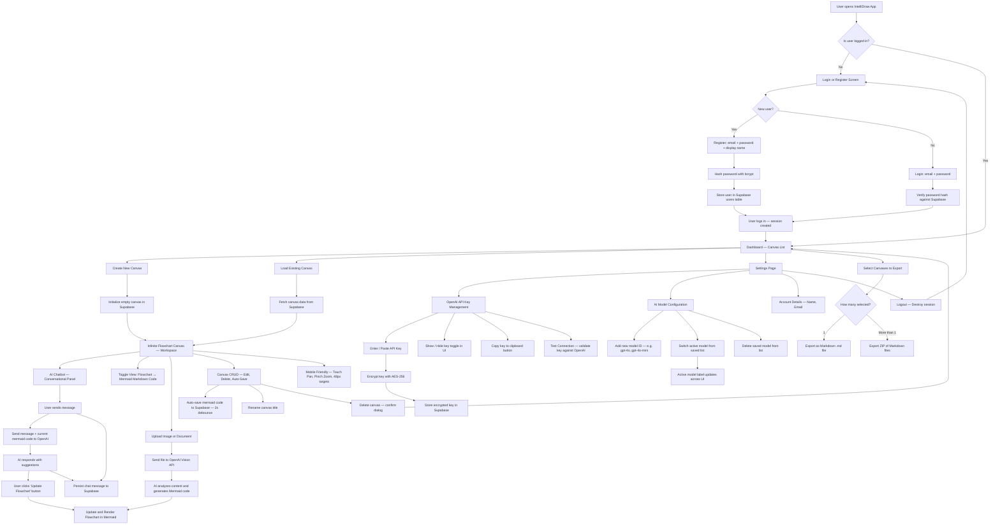
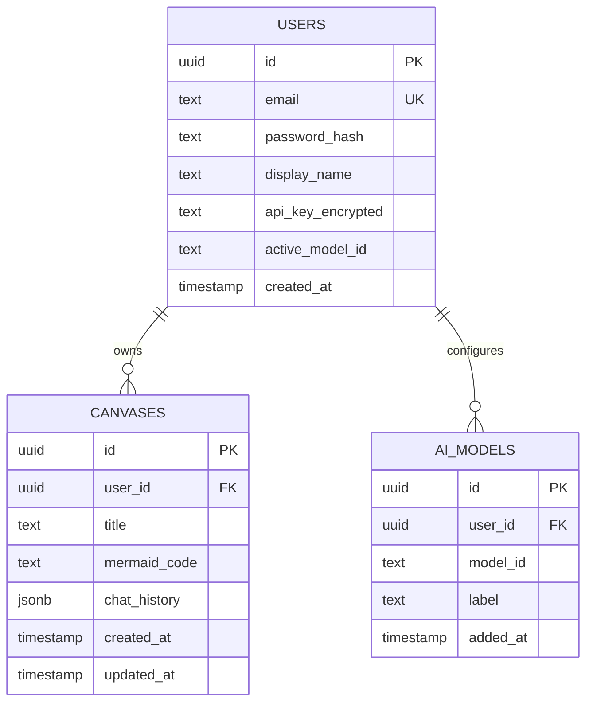
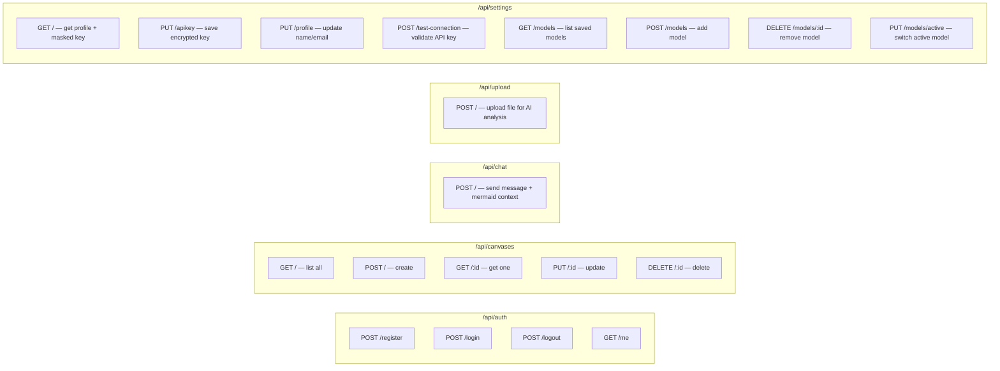
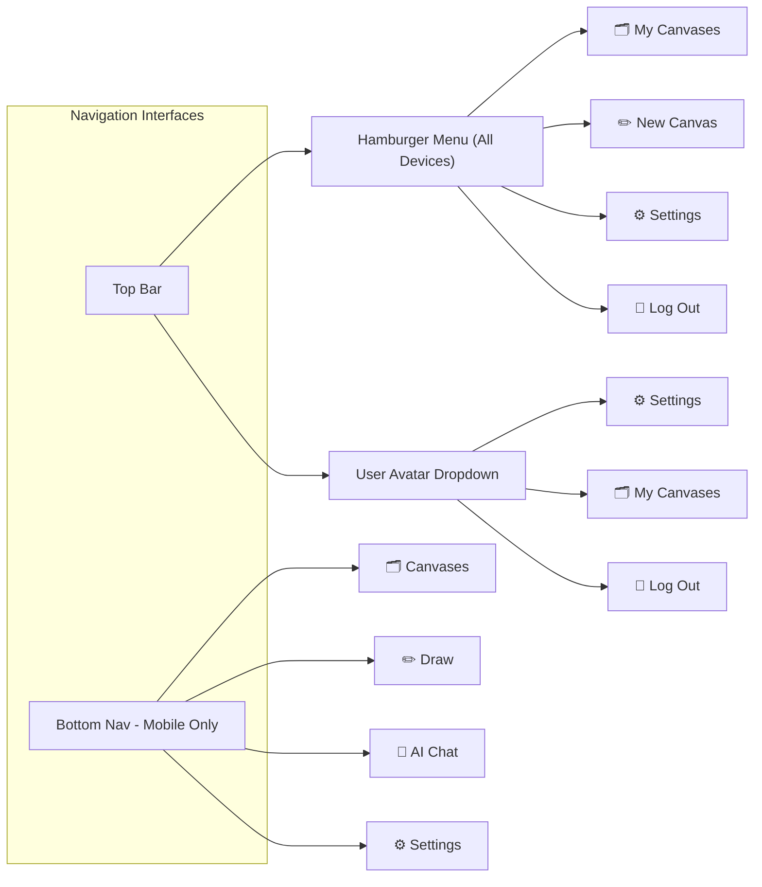

# IntelliDraw

Intellidraw is an AI powered, infinite canvas, natural language, mermaid flowchart generator/management tool.

## Tech Stack

- **Frontend:** Vite + React + TypeScript + TailwindCSS v3
- **Backend:** Vercel Serverless Functions (Node.js)
- **Database:** Supabase (PostgreSQL)
- **Auth:** Local email/password (bcrypt, session-based)
- **AI:** OpenAI API (BYOK — Bring Your Own Key)

---

## Core Application Flow

---

## Database Schema (Supabase — PostgreSQL)

---

## API Routes (Vercel Serverless Functions)

---

## Navigation Flow

---

## Key Implementation Notes

<!-- 
  These comments document critical decisions made during planning.
  Reference these when implementing to ensure consistency.
-->

### Authentication
- **Local auth only** — email + password, no OAuth/social providers
- Passwords hashed with `bcrypt` before storing in Supabase
- Sessions managed server-side (Vercel serverless compatible via JWT tokens)

### API Key Security
- API key encrypted with **AES-256** using a server-side secret (`ENCRYPTION_KEY` env var)
- Stored encrypted in the `users.api_key_encrypted` column in Supabase
- Decrypted only server-side when making OpenAI API calls
- **UI features:** show/hide toggle button + copy-to-clipboard button

### AI Model Management
- Users can register **multiple OpenAI model IDs** (e.g., `gpt-4o`, `gpt-4o-mini`, `o1-preview`)
- One model is set as **active** at a time (`users.active_model_id`)
- The **UI label always shows the actual model ID** in use — no hardcoded display names
- Model switching is done from the Settings page

### Chat History
- Chat messages are **persisted per canvas** in the `canvases.chat_history` JSONB column
- When a canvas is re-opened, the full conversation history is restored
- Each message stores: `{ role, content, timestamp }`

### Canvas Auto-Save
- Mermaid code changes trigger an auto-save to Supabase with a **2-second debounce**
- Title changes save immediately on blur

### Deployment
- **Frontend:** Vite build output deployed to Vercel
- **Backend:** All API routes as Vercel Serverless Functions (`/api/*`)
- **Database:** Supabase hosted PostgreSQL (connection via environment variable)

### UI & Navigation Design
- All layouts are **mobile-first** with responsive breakpoints (sm → md → lg)
- **Top Navigation:** Continuous top bar with a **universal hamburger menu** (all devices) opening a slide-out sidebar, and a **user avatar dropdown** for account/settings shortcuts.
- **Mobile Navigation:** Bottom navigation bar handles quick switching on mobile devices.
- **Canvas Interaction:** Supports **pinch-zoom**, **two-finger pan**, and maintains minimum **48px** touch targets per standard guidelines.
- **AI Chat Layout:**
  - On **desktop**, chat is a steady right **side panel**.
  - On **mobile**, chat is a **collapsible bottom-sheet covering the lower half of the screen**. The toggle button for this sheet sits beside the active chat input bar.