# Debug Logic Flow — As Built in Codebase

> This documents the **actual** code flow when a user's input triggers broken Mermaid code,
> traced directly from `WorkspacePage.tsx` and `MermaidRenderer.tsx`.

## Sequence Overview

```
User sends chat → AI returns broken Mermaid → User clicks "Update Flowchart"
→ MermaidRenderer fails → onSyntaxError fires → handleSyntaxError runs
→ fetches rules → calls apiChat with fix message → fixed code → setMermaidCode
→ MermaidRenderer re-renders → success (or retry blocked by ref guard)
```

## Full Logic Flow

```mermaid
flowchart TD
    Start(["User types message and clicks Send"]) --> A["handleSendMessage runs"]
    A --> B["chatLoading = true"]
    B --> C["apiChat called with user message + current mermaidCode"]
    C --> D{"API returns result"}
    D -->|Success| E["Assistant message added to chatHistory"]
    D -->|Error| ERR1["Error message added to chatHistory"]
    ERR1 --> STOP1(["Chat error — flow ends"])

    E --> F{"result.updatedMermaidCode exists?"}
    F -->|No| G["chatLoading = false — no diagram change"]
    G --> STOP2(["No code update — flow ends"])
    F -->|Yes| H["setPendingMermaid with new code"]
    H --> I["Pending banner appears: AI generated a new flowchart"]
    I --> J{"User clicks Update Flowchart?"}
    J -->|Dismiss| K["setPendingMermaid null — old diagram stays"]
    K --> STOP3(["User dismissed — flow ends"])
    J -->|Update| L["handleApplyMermaid runs"]
    L --> M["setMermaidCode with pendingMermaid"]
    M --> N["autoSave triggered"]
    N --> O["setPendingMermaid null"]

    O --> RENDER["MermaidRenderer useEffect fires — code changed, isFixing is false"]

    RENDER --> P{"code is empty?"}
    P -->|Yes| Q["Clear SVG and error state"]
    Q --> STOP4(["Empty code — flow ends"])
    P -->|No| R{"isFixing is true?"}
    R -->|Yes| S["Skip render — return early"]
    S --> FIXING_UI["Canvas shows: Debugging new code... spinner"]
    R -->|No| T["renderDiagram called"]
    T --> U["renderCounter++ — unique ID created"]
    U --> V["mermaid.render called with code"]

    V --> W{"Render succeeds?"}
    W -->|Yes| X["setSvgHtml with SVG output"]
    X --> Y["setError null"]
    Y --> Z["fixTriggeredForRef reset to null"]
    Z --> AA["cleanupMermaidErrors removes stray DOM elements"]
    AA --> SUCCESS(["Diagram appears on canvas"])

    W -->|No| BB["Error caught — errMsg extracted"]
    BB --> CC["cleanupMermaidErrors removes bomb SVGs from body"]
    CC --> DD{"onSyntaxError callback exists?"}
    DD -->|No| EE["setError with errMsg — red error box shown"]
    EE --> STOP5(["Static error displayed — flow ends"])

    DD -->|Yes| FF{"fixTriggeredForRef.current === code.trim?"}
    FF -->|Yes — already tried this exact code| GG["Do nothing — no error shown, no retry"]
    GG --> STOP6(["Silent dead end — fix already attempted for this code"])
    FF -->|No — first time seeing this code| HH["fixTriggeredForRef.current = code.trim"]
    HH --> II["onSyntaxError callback fires with errMsg + code"]
    II --> JJ["setError null — error hidden from user"]
    JJ --> KK["setSvgHtml empty"]

    II --> HANDLER["handleSyntaxError in WorkspacePage runs"]

    HANDLER --> LL{"isFixing OR chatLoading is true?"}
    LL -->|Yes| MM["Return early — guard prevents double-fire"]
    MM --> STOP7(["Guarded — flow ends"])
    LL -->|No| NN["isFixing = true, chatLoading = true"]
    NN --> OO["Debug message added to chat: Hold on, debugging..."]
    OO --> PP["Chat panel shows bouncing dots animation"]

    PP --> QQ["apiGetActiveRules called — GET /api/rules_active"]
    QQ --> RR{"Rules returned from DB?"}
    RR -->|Yes, rules exist| SS["fixMessage += sanitization rules appended"]
    RR -->|No rules or empty| TT["fixMessage stays generic fix-only"]
    SS --> UU["apiChat called with fixMessage + brokenCode + chatHistory"]
    TT --> UU

    UU --> VV{"apiChat returns result?"}
    VV -->|Error / catch| WW["Error message added to chat"]
    WW --> XX["isFixing = false, chatLoading = false"]
    XX --> STOP8(["Auto-fix failed — flow ends"])

    VV -->|Success| YY{"result.updatedMermaidCode exists?"}
    YY -->|No| ZZ["AI response shown in chat as-is — no code extracted"]
    ZZ --> AAA["isFixing = false, chatLoading = false"]
    AAA --> STOP9(["No code in fix response — flow ends"])

    YY -->|Yes| BBB["Fixed message added to chat"]
    BBB --> CCC["setMermaidCode with fixed code — DIRECT, no pending button"]
    CCC --> DDD["autoSave with fixed code"]
    DDD --> EEE["isFixing = false, chatLoading = false"]

    EEE --> FFF["MermaidRenderer useEffect fires again — code changed AND isFixing changed"]
    FFF --> GGG{"isFixing is false now — proceed to render"}
    GGG --> HHH["mermaid.render called with fixed code"]

    HHH --> III{"Fixed code renders successfully?"}
    III -->|Yes| SUCCESS
    III -->|No| JJJ["Error caught again"]
    JJJ --> KKK{"fixTriggeredForRef === this new code?"}
    KKK -->|No — different code from last attempt| LLL["onSyntaxError fires AGAIN — potential second fix attempt"]
    LLL -->|"handleSyntaxError re-enters"| HANDLER
    KKK -->|Yes — same code| MMM["Silent dead end — no error shown, no retry"]
    MMM --> STOP10(["Stuck — fix returned same broken code"])
```



## Key Components Involved

| Component | File | Role |
|---|---|---|
| `handleSendMessage` | `WorkspacePage.tsx:167` | User chat — triggers AI response and sets pendingMermaid |
| `handleApplyMermaid` | `WorkspacePage.tsx:210` | User clicks Update Flowchart — sets mermaidCode from pending |
| `MermaidRenderer useEffect` | `MermaidRenderer.tsx:61` | Runs on code or isFixing change — calls mermaid.render |
| `cleanupMermaidErrors` | `MermaidRenderer.tsx:31` | Removes orphaned bomb-icon SVGs from document.body |
| `fixTriggeredForRef` | `MermaidRenderer.tsx:55` | Tracks code string already sent for fix — prevents same-code loop |
| `onSyntaxError callback` | `MermaidRenderer.tsx:90-92` | Fires parent handler when render fails on new code |
| `handleSyntaxError` | `WorkspacePage.tsx:100` | Fetches rules, calls apiChat with fix message, applies result directly |
| `apiGetActiveRules` | `api.ts / rules_active.ts` | Fetches active sanitization rule descriptions from DB |
| `apiChat` | `api.ts / chat.ts` | Standard chat endpoint — used for both user messages AND auto-fix |

## Guard Rails Currently in Code

1. **`isFixing \|\| chatLoading` guard** — `handleSyntaxError` line 101 — prevents double-fire while a fix is in progress
2. **`fixTriggeredForRef`** — `MermaidRenderer.tsx` line 90 — prevents re-triggering for the **exact same** code string
3. **`isFixing` skip** — `MermaidRenderer.tsx` line 69 — skips render attempts entirely while fix is in flight

## Known Edge Case

If the AI returns **different but still broken** code, `fixTriggeredForRef` will NOT match it since it is a new string. This means `onSyntaxError` fires again, entering `handleSyntaxError` a second time. By then `isFixing` and `chatLoading` are both `false` in the finally block, so the guard on line 101 passes. This creates a **potential loop** where each fix attempt returns different broken code, triggering another attempt indefinitely. In practice this is unlikely since the AI usually fixes it in one pass, but there is **no max-retry cap** in the current code.
