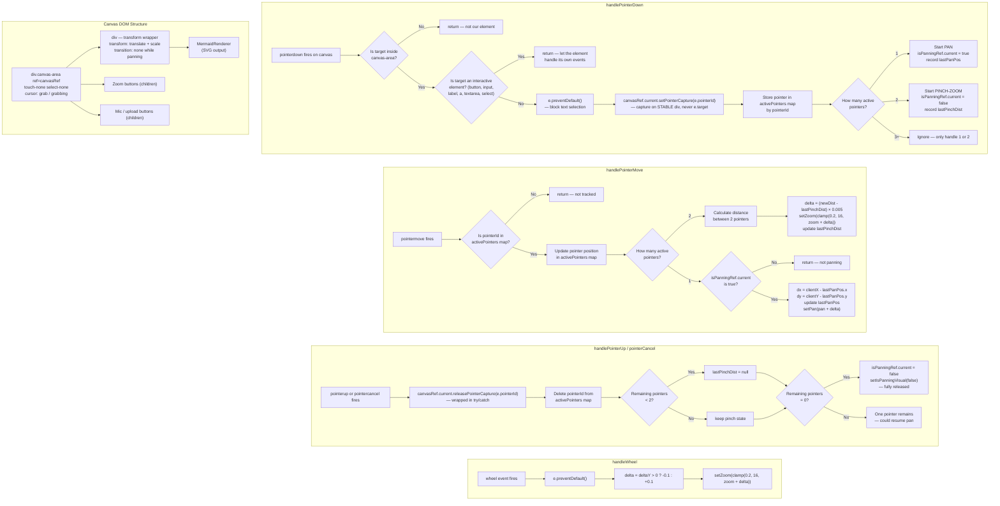

# Dragging / Pan & Zoom — Complete Logic Reference

> A battle-tested reference for building a drag surface in React using the Pointer Events API.  
> Covers mouse, touch, and stylus in a single unified system.

---

## Architecture Flowchart



---

## The 5 Rules of a Correct Drag Surface

### Rule 1: Use Pointer Events (not mouse + touch separately)

The Pointer Events API (`onPointerDown`, `onPointerMove`, `onPointerUp`, `onPointerCancel`) unifies mouse, touch, and stylus into a single set of handlers. Each pointer gets a unique `pointerId` — use this to track multi-touch.

```tsx
// ❌ BAD — two separate systems to maintain
onMouseDown={handleMouseDown}
onTouchStart={handleTouchStart}

// ✅ GOOD — one system handles everything
onPointerDown={handlePointerDown}
onPointerMove={handlePointerMove}
onPointerUp={handlePointerUp}
onPointerCancel={handlePointerUp}  // ← don't forget this
```

> **Bug avoided:** Inconsistent behavior between mouse and touch.

---

### Rule 2: Always use `setPointerCapture` on a STABLE element

Without pointer capture, if the pointer leaves the canvas div (off-screen, over a sibling element like an input bar), the canvas stops receiving `pointermove` and `pointerup` events. The drag state gets stuck permanently.

**Critical detail:** Capture must be on a **stable DOM element** (like the container `ref`), **never on `e.target`**.

```tsx
// ❌ BAD — e.target could be an SVG child that React destroys on re-render
(e.target as HTMLElement).setPointerCapture(e.pointerId);

// ✅ GOOD — canvasRef is stable, survives re-renders
canvasRef.current?.setPointerCapture(e.pointerId);
```

And release on pointer up:
```tsx
const handlePointerUp = (e: React.PointerEvent) => {
  try {
    canvasRef.current?.releasePointerCapture(e.pointerId);
  } catch { /* already released */ }
  // ... cleanup state
};
```

> **Bug avoided:** Drag gets stuck when pointer leaves the canvas area or crosses a sibling element. Also prevents silent capture loss when React re-renders the captured SVG element.

---

### Rule 3: Guard interactive children from the drag handler

Buttons, inputs, and other interactive elements inside the canvas area will have their clicks broken if the drag handler captures their pointer events.

```tsx
const handlePointerDown = (e: React.PointerEvent) => {
  // First: is it even in our canvas?
  if (!(e.target === canvasRef.current 
    || (e.target as HTMLElement).closest(".canvas-area"))) return;

  // Second: don't hijack interactive elements
  const target = e.target as HTMLElement;
  if (target.closest("button, a, input, label, textarea, select, [role='button']")) return;

  // Now safe to capture and pan
  e.preventDefault();
  canvasRef.current?.setPointerCapture(e.pointerId);
  // ...
};
```

> **Bug avoided:** Mic button, zoom buttons, file upload buttons stop working because the canvas steals their pointer lifecycle.

---

### Rule 4: Use a `ref` for drag state, not React state

React's `useState` is asynchronous. If you set `setIsPanning(true)` in `handlePointerDown`, the very next `handlePointerMove` event (firing milliseconds later, before React re-renders) still reads `isPanning === false` from the stale closure.

```tsx
// ❌ BAD — stale closure, first N move events get dropped
const [isPanning, setIsPanning] = useState(false);

const handlePointerMove = (e: React.PointerEvent) => {
  if (isPanning) { /* won't be true yet! */ }
};

// ✅ GOOD — synchronous, always up-to-date
const isPanningRef = useRef(false);
const [isPanningVisual, setIsPanningVisual] = useState(false); // for cursor style only

const handlePointerMove = (e: React.PointerEvent) => {
  if (isPanningRef.current) { /* always correct */ }
};
```

Use the ref for logic, state for visual updates (cursor style, CSS transitions).

> **Bug avoided:** Pan feels sluggish or drops the first few pixels of movement.

---

### Rule 5: Prevent default behaviors with CSS AND JavaScript

Two layers are needed to fully prevent text selection and browser scroll/zoom:

**CSS on the canvas div:**
```css
touch-none     /* disables browser touch gestures (scroll, pinch zoom) */
select-none    /* disables text selection via CSS (user-select: none) */
```

**JavaScript in the handler:**
```tsx
e.preventDefault(); // blocks the remaining default behavior (text selection on drag)
```

> **Bug avoided:** Text/SVG nodes get highlighted while dragging. Browser does its own pinch-zoom on top of yours.

---

## State Architecture

```
┌─────────────────────────────────────────────────────────────┐
│                        REFS (synchronous)                   │
│                                                             │
│  isPanningRef ──────── true/false (drag logic reads this)   │
│  lastPanPos ────────── { x, y } (last pointer position)     │
│  activePointers ────── Map<pointerId, {x, y}>               │
│  lastPinchDist ─────── number | null                        │
│  canvasRef ─────────── stable div element                   │
│                                                             │
├─────────────────────────────────────────────────────────────┤
│                     STATE (triggers re-render)              │
│                                                             │
│  isPanningVisual ───── cursor: grab vs grabbing             │
│  zoom ──────────────── transform scale                      │
│  pan ───────────────── transform translate                  │
│                                                             │
└─────────────────────────────────────────────────────────────┘
```

**Why the split?** Refs update synchronously (critical for 60fps pointer tracking). State updates trigger re-renders (needed for visual changes). Mixing them up causes either dropped frames or stale data.

---

## Transform Application

The pan and zoom values drive a CSS transform on an inner wrapper div:

```tsx
<div
  className="min-h-full w-full flex items-center justify-center"
  style={{
    transform: `translate(${pan.x}px, ${pan.y}px) scale(${zoom})`,
    transformOrigin: "center center",
    transition: isPanningVisual ? "none" : "transform 0.1s ease-out",
  }}
>
  {/* content */}
</div>
```

- **While dragging:** `transition: none` — instant response, no lag.
- **After release:** `transition: 0.1s ease-out` — smooth settle into final position.
- **`transformOrigin: center center`** — zoom scales from the center of the viewport.

---

## Multi-Touch: Pan vs Pinch Decision Tree

```
1 pointer active → PAN mode (translate)
2 pointers active → PINCH-ZOOM mode (scale)
3+ pointers → ignored

Transition from pan → pinch:
  - Second pointer down → cancel pan, start tracking distance
  
Transition from pinch → single pointer:
  - One pointer lifts → reset pinchDist
  - Could resume pan with remaining pointer (optional)
```

---

## Common Bugs & Their Root Causes (Quick Reference)

| Symptom | Root Cause | Fix |
|---|---|---|
| Text highlights while dragging | No `e.preventDefault()` + no `select-none` CSS | Add both |
| Drag gets stuck when pointer leaves canvas | No `setPointerCapture` | Add capture on stable element |
| Drag gets stuck when releasing over sibling element | `setPointerCapture` on `e.target` (ephemeral SVG child) instead of stable container ref | Capture on `canvasRef.current` |
| Buttons inside canvas stop working | Drag handler captures their pointer events | Guard with `target.closest("button, ...")` |
| Zoom breaks permanently (only pans) | Ghost entries in `activePointers` from missed `pointerUp` | Pointer capture ensures `pointerUp` always fires |
| Pan feels sluggish / drops first pixels | `isPanning` stored as React state (async) | Use `useRef` for the flag |
| Browser does its own pinch zoom on top of yours | Missing `touch-none` CSS on canvas | Add `touch-none` class |
| `pointerCancel` not handled | Tab switch, system dialog, etc. cancels pointer silently | Bind `onPointerCancel={handlePointerUp}` |

---

## Minimal Boilerplate (Copy-Paste Starter)

```tsx
import { useState, useRef } from "react";

export default function DragCanvas() {
  const [zoom, setZoom] = useState(1);
  const [pan, setPan] = useState({ x: 0, y: 0 });
  const isPanningRef = useRef(false);
  const [isPanningVisual, setIsPanningVisual] = useState(false);
  const lastPanPos = useRef({ x: 0, y: 0 });
  const canvasRef = useRef<HTMLDivElement>(null);

  const handlePointerDown = (e: React.PointerEvent) => {
    const target = e.target as HTMLElement;
    if (target.closest("button, a, input, label, textarea, select, [role='button']")) return;

    e.preventDefault();
    canvasRef.current?.setPointerCapture(e.pointerId);
    isPanningRef.current = true;
    setIsPanningVisual(true);
    lastPanPos.current = { x: e.clientX, y: e.clientY };
  };

  const handlePointerMove = (e: React.PointerEvent) => {
    if (!isPanningRef.current) return;
    const dx = e.clientX - lastPanPos.current.x;
    const dy = e.clientY - lastPanPos.current.y;
    lastPanPos.current = { x: e.clientX, y: e.clientY };
    setPan((p) => ({ x: p.x + dx, y: p.y + dy }));
  };

  const handlePointerUp = (e: React.PointerEvent) => {
    try { canvasRef.current?.releasePointerCapture(e.pointerId); } catch {}
    isPanningRef.current = false;
    setIsPanningVisual(false);
  };

  const handleWheel = (e: React.WheelEvent) => {
    e.preventDefault();
    const delta = e.deltaY > 0 ? -0.1 : 0.1;
    setZoom((z) => Math.min(10, Math.max(0.2, z + delta)));
  };

  return (
    <div
      ref={canvasRef}
      className="touch-none select-none"
      style={{ cursor: isPanningVisual ? "grabbing" : "grab", overflow: "hidden" }}
      onWheel={handleWheel}
      onPointerDown={handlePointerDown}
      onPointerMove={handlePointerMove}
      onPointerUp={handlePointerUp}
      onPointerCancel={handlePointerUp}
    >
      <div
        style={{
          transform: `translate(${pan.x}px, ${pan.y}px) scale(${zoom})`,
          transformOrigin: "center center",
          transition: isPanningVisual ? "none" : "transform 0.1s ease-out",
        }}
      >
        {/* Your content here */}
      </div>
    </div>
  );
}
```
